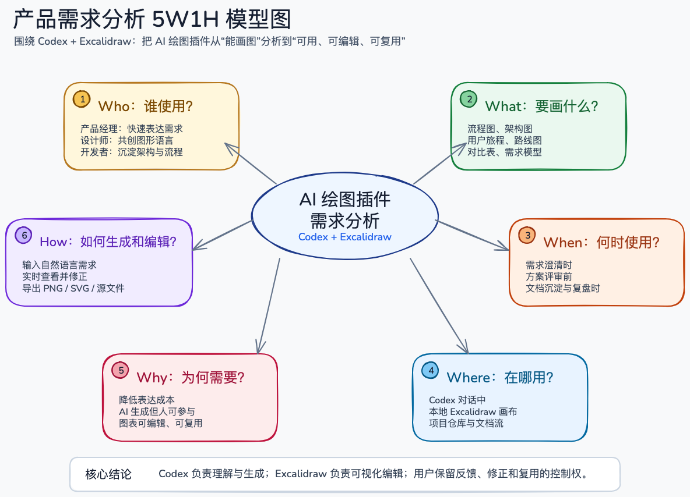
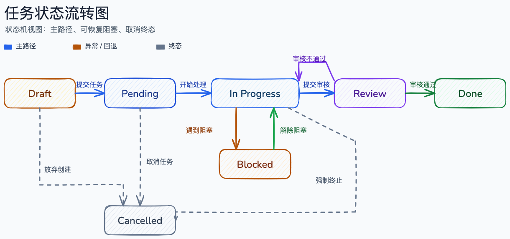
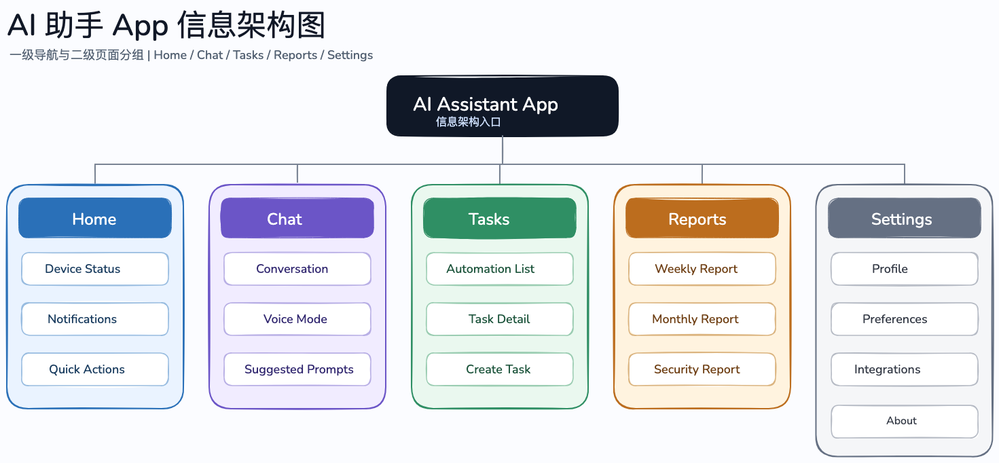

# Codex Excalidraw

[English](README.md) | 简体中文

让 Codex / Claude Code 在你的本地 Excalidraw 画布上帮你画图、改图、继续协作。

它适合用来生成：

* 系统架构图
* 产品流程图
* 页面地图
* 低保真界面草图
* 决策树
* 泳道图
* 白板讨论图
* 概念关系图
* 从 Mermaid 转成可编辑的 Excalidraw 图

和普通图片生成不同，这个项目生成的是 可以继续编辑的 Excalidraw 画布。
你可以让 AI 先画一版，再在浏览器里手动修改，之后继续让 AI 读取画布并帮你优化。

⸻

它解决什么问题？

很多时候，我们不只是想要一张图，而是想要一个可以继续改、继续讨论、继续协作的画布。

Codex Excalidraw 主要解决这些问题：

* AI 能直接在 Excalidraw 画布上绘图；
* 你可以在浏览器里看到生成过程和结果；
* 画出来的内容不是静态图片，而是可编辑元素；
* 你手动修改后，AI 还能继续读取并理解当前画布；
* 适合把技术方案、产品流程、交互结构快速变成图。

⸻

快速开始

你可以直接把下面这段话复制给 Codex 或 Claude Code：

请帮我安装并运行这个项目：
https://github.com/Vontean/Codex-Excalidraw
要求：
1. 克隆项目到本地；
2. 按 README 完成安装；
3. 启动本地 Excalidraw 工作台；
4. 打开 http://127.0.0.1:3000/；
5. 帮我验证 Codex / Claude Code 是否可以在画布上创建、读取和修改图形。

安装完成后，重启 Codex 或 Claude Code，让新的绘图能力生效。

⸻

手动安装

如果你想自己在终端里安装，可以使用：

git clone https://github.com/Vontean/Codex-Excalidraw.git
cd Codex-Excalidraw
npm run setup

setup 会先检测本机是否已经有可用于导出的浏览器，例如 Playwright browser cache 或系统 Chrome / Chromium。如果没有检测到，它会询问是否下载 Playwright Chromium；你也可以选择不下载，之后自己安装或通过 EXCALIDRAW_CODEX_BROWSER_EXECUTABLE 指定浏览器路径。

然后启动本地工作台：

excalidraw-codex serve

打开浏览器访问：

http://127.0.0.1:3000/

⸻

使用方式

打开工作台后，你可以直接对 Codex 或 Claude Code 说：

用 Excalidraw 画一个可编辑的系统架构图。

或者：

根据当前项目，画一个用户从注册到完成下单的产品流程图。

也可以让它继续修改：

把这个流程图改成泳道图，按用户、前端、后端、数据库四个角色拆分。

⸻

典型使用场景

1. 技术架构图

适合画：

* 前后端架构
* API 调用关系
* 数据流
* 模块依赖
* 部署结构

示例：

画一个 Web App 的系统架构图，包含前端、后端、数据库、缓存、对象存储和第三方登录服务。

2. 产品流程图

适合画：

* 用户路径
* 页面跳转
* 操作流程
* 异常分支
* Onboarding 流程

示例：

画一个新用户首次使用 App 的 Onboarding 流程图，包含注册、权限授权、偏好设置和首页引导。

3. 低保真界面草图

适合画：

* Web 页面结构
* App 页面框架
* Dashboard 布局
* 表单页面
* 设置页

示例：

画一个低保真的移动端首页草图，包含顶部状态卡片、快捷入口、通知列表和底部导航。

4. 白板式讨论

适合画：

* 概念地图
* 证据板
* 问题拆解
* 方案对比
* 金字塔结构

示例：

用金字塔原理画一个产品改版汇报结构，顶部是核心结论，下面分成用户问题、设计方案、数据验证三部分。

效果示例

下面这些 PNG 来自本地 Excalidraw 画布导出，可以作为生成效果参考。

codex-excalidraw-5w1h-requirements

test-4-task-status-transition

ai-assistant-app-ia

⸻

生成的文件在哪里？

默认生成的画布和导出文件会保存在：

artifacts/excalidraw/

你可以在这里找到 Excalidraw 文件、截图和导出结果。

⸻

环境要求

需要提前安装：

* Node.js 20 或更新版本
* npm
* macOS、Linux 或 Windows 终端环境

推荐使用 Node.js 22 LTS。

⸻

这个项目包含什么？

你不需要先理解这些也能使用。
如果你想知道它的内部结构，可以简单理解为：

* 一个本地 Excalidraw 工作台；
* 一个 excalidraw-codex 命令行工具；
* 一个给 AI 读取和修改画布的 MCP 服务；
* 一套给 Codex / Claude Code 使用的绘图工作流。

⸻

Libraries

项目支持加载 Excalidraw libraries。
你可以把常用的线框图组件、流程图组件、商业画布组件、数据可视化组件加入画布素材库。

查看本地 libraries：

excalidraw-codex library list

搜索 library：

excalidraw-codex library search "wireframe"

安装后，素材会出现在 Excalidraw 的 Library 面板里。

⸻

常见问题

这是图片生成工具吗？

不是。

它生成的是 Excalidraw 画布内容，里面的元素可以继续编辑、拖拽、复制和修改。

我可以手动修改 AI 画的图吗？

可以。

你可以在浏览器里直接修改画布。修改后，AI 可以继续读取当前画布，并基于你的修改继续优化。

它和 Mermaid 有什么区别？

Mermaid 更适合用文本快速生成结构化图表。
Excalidraw 更适合做自由画布、低保真草图、白板讨论和可视化表达。

你也可以先用 Mermaid 生成基础结构，再让 AI 转成 Excalidraw 画布继续编辑。

适合谁用？

适合经常需要把想法画出来的人，例如：

* 产品经理
* 设计师
* 独立开发者
* 工程师
* 技术写作者
* 使用 Codex / Claude Code 做项目开发的人

⸻

License

MIT
